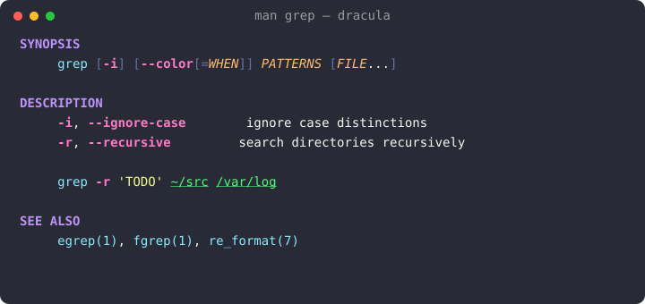
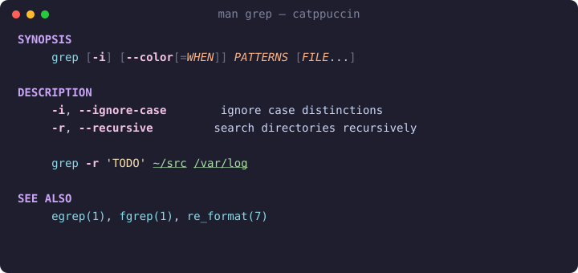
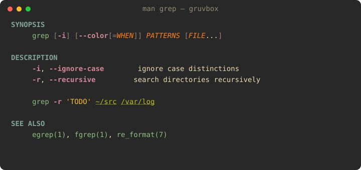
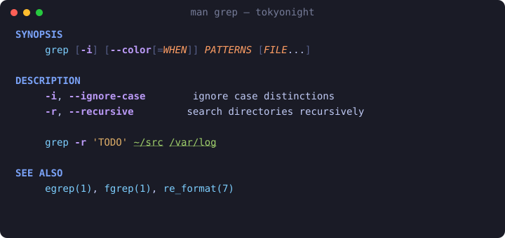
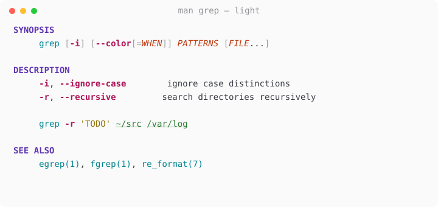
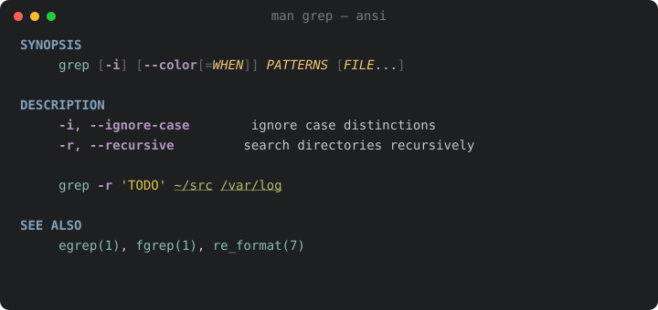

<h1 align="center">colored-man-pages-plus</h1>

<p align="center">
  <em>Man pages, but they spark joy.</em><br>
  A semantic, themeable man-page colorizer for zsh — a drop-in upgrade to oh-my-zsh's <code>colored-man-pages</code>.
</p>

<p align="center">
  
</p>

---

## Why another one?

The stock `colored-man-pages` can only tint by **text attribute**. `less`'s
termcap exposes just *bold*, *underline*, and *standout* — so every bold token
becomes one color and every underlined token another. It has no idea what's a
flag, a path, or a section header.

**colored-man-pages-plus** colors by **meaning**. It decodes groff/mandoc's own
formatting and assigns a distinct, theme-defined color to each *role*: section
headers, commands, flags, arguments, paths, and literals. That semantic layer is
what makes real theming — and real fun — possible.

| | stock `colored-man-pages` | `colored-man-pages-plus` |
|---|---|---|
| Coloring basis | text attribute (3 buckets) | semantic role (8 roles) |
| Themes | none | 6 built-in + `auto` + your own |
| Truecolor | ✗ | ✓ (with 256/16 fallback) |
| Clickable cross-refs | ✗ | ✓ (OSC-8 links) |
| Light/dark detection | ✗ | ✓ (`auto`) |
| Live theme switching | ✗ | ✓ (`man-theme`) |

---

## 🎨 Theme gallery

Same page, six moods. (These previews are generated **directly from the theme
files**, so they always match what you'll actually see.)

| | |
|:---:|:---:|
| **Dracula** | **Catppuccin Mocha** |
|  |  |
| **Gruvbox** | **Tokyo Night** |
|  |  |
| **Light** | **ansi** *(inherits your terminal's 16 colors)* |
|  |  |

Pick one in two keystrokes:

```sh
man-theme set tokyonight
```

---

## Install

### oh-my-zsh

```sh
git clone https://github.com/diverdale/colored-man-pages-plus \
  "${ZSH_CUSTOM:-$HOME/.oh-my-zsh/custom}/plugins/colored-man-pages-plus"
```

Add it to your plugin list in `~/.zshrc` — and **remove the stock
`colored-man-pages`** so they don't both wrap `man`:

```sh
plugins=(... colored-man-pages-plus)
```

Reload with `exec zsh`, then run any `man` page. That's it.

### Without oh-my-zsh

```sh
git clone https://github.com/diverdale/colored-man-pages-plus ~/.colored-man-pages-plus
echo 'source ~/.colored-man-pages-plus/colored-man-pages-plus.plugin.zsh' >> ~/.zshrc
```

---

## 🎭 Theming — the fun part

There are four ways to control color, from "just pick a vibe" to "repaint every
pixel."

### 1. Pick a built-in theme

Either form works; `zstyle` is the oh-my-zsh-native one.

```sh
zstyle ':colored-man:theme' name catppuccin     # the idiomatic way
export COLORED_MAN_THEME=catppuccin              # or a plain env var
```

Built-ins: `dracula` · `catppuccin` · `gruvbox` · `tokyonight` · `light` · `ansi`

### 2. Let it match your terminal — `auto`

`auto` asks your terminal for its background color (OSC 11) and picks the
`light` theme on a light background, or your chosen dark theme otherwise:

```sh
export COLORED_MAN_THEME=auto
export COLORED_MAN_DARK_THEME=gruvbox    # used when the background is dark
```

Now your man pages follow you from a sunny café to a late-night session
automatically. Detection is cached per shell, times out safely, and falls back
to dark if your terminal stays quiet.

### 3. Match your *whole* scheme — `ansi`

The `ansi` theme doesn't ship its own colors — it maps each role onto your
terminal's own **16 ANSI colors**. So whatever scheme you already run (your
Gogh/iTerm/base16 palette), man pages will use *those exact colors* and stay in
visual harmony with the rest of your terminal. Zero config, infinitely personal.

```sh
export COLORED_MAN_THEME=ansi
```

### 4. Override individual roles

Love a theme but want flags to *pop*? Override just that role — hex or an ANSI
index — and keep everything else:

```sh
typeset -A COLORED_MAN_OVERRIDE
COLORED_MAN_OVERRIDE[flag]="#ff5555"      # screaming red flags
COLORED_MAN_OVERRIDE[path]="#00d7ff"      # neon paths
COLORED_MAN_OVERRIDE[literal]=11          # ANSI bright-yellow
```

Overrides win over the active theme, so you can layer a couple of personal
tweaks on top of any built-in.

### The roles

Every theme is just a map from these roles to colors:

| Role | What it paints | Style |
|------|----------------|-------|
| `header` | top-level sections (`NAME`, `SYNOPSIS`, …) | bold |
| `subheader` | indented sub-sections | bold |
| `command` | the page's command + `name(N)` cross-refs | — |
| `flag` | `-i`, `--ignore-case` | bold |
| `argument` | italic placeholders (`PATTERNS`, `file`) | italic |
| `path` | `/var/log`, `~/.config` | underline |
| `literal` | `'quoted'` / `"quoted"` strings | — |
| `punct` | brackets & pipes in `SYNOPSIS`; separator rules | — |
| `default` | body text | — (usually the terminal default) |

### 🖌️ Build your own theme

A theme is a 9-line file. Copy one, recolor it, and it shows up instantly:

```sh
cp "$ZSH_CUSTOM/plugins/colored-man-pages-plus/themes/dracula.zsh" \
   "$ZSH_CUSTOM/plugins/colored-man-pages-plus/themes/synthwave.zsh"
```

```zsh
# themes/synthwave.zsh
cmp_palette=(
  header    "#ff7edb"
  subheader "#ff7edb"
  command   "#36f9f6"
  flag      "#fede5d"
  argument  "#ff8b39"
  path      "#72f1b8"
  literal   "#f97e72"
  punct     "#495495"
  default   ""        # "" = leave body text the terminal default
)
```

```sh
man-theme preview synthwave    # admire it
man-theme set synthwave --save # keep it
```

Made something nice? PRs adding themes are very welcome — see
[Contributing](#contributing).

---

## 🧪 `man-theme` — the switcher

```sh
man-theme                      # list themes, marking the active one
man-theme preview              # render a sample in dracula/catppuccin/gruvbox/tokyonight
man-theme preview gruvbox      # ...or a specific one
man-theme set tokyonight       # switch for this session
man-theme set dracula --save   # switch and persist to ~/.zshrc
man-theme current              # print the active theme name
```

`preview` paints a real sample page right in your terminal, so you can
comparison-shop themes without leaving the prompt.

---

## Features

- **Semantic highlighting** — 8 roles, derived from groff/mandoc's own bold/italic
  output plus light heuristics (so attributes come from groff, not guesswork).
- **6 curated themes + `auto` + `ansi` + bring-your-own.**
- **Truecolor with graceful fallback** — 24-bit → 256 → 16, detected automatically.
- **Clickable cross-references** — `name(1)` refs and URLs become OSC-8 hyperlinks
  in terminals that support them.
- **Section separators** — subtle rules between top-level sections for scannability.
- **Fail-safe** — honors `NO_COLOR`, never colorizes piped/redirected output, and
  passes anything it doesn't recognize through untouched. Worst case: uncolored,
  never mangled.

---

## ⚙️ Full configuration reference

All optional. Defaults: `dracula`, links on, separators on.

```sh
# Theme
zstyle ':colored-man:theme' name dracula     # or: export COLORED_MAN_THEME=dracula
export COLORED_MAN_THEME=auto                # detect light/dark
export COLORED_MAN_DARK_THEME=gruvbox        # dark theme `auto` falls back to

# Per-role overrides (hex like "#ff0000" or an ANSI index 0-15)
typeset -A COLORED_MAN_OVERRIDE
COLORED_MAN_OVERRIDE[flag]="#ff5555"

# Toggles
export COLORED_MAN_SEPARATORS=off            # default on
export COLORED_MAN_LINKS=off                 # default on
export COLORED_MAN_FORCE=1                   # use our pager even if MANPAGER is set
```

---

## How it works

`man` formats a page and pipes it to `$MANPAGER`. The plugin points `MANPAGER`
at [`lib/shim.sh`](lib/shim.sh), which runs the text through
[`lib/colorize.awk`](lib/colorize.awk) (in byte mode, for deterministic parsing)
and into `less -R`. The awk engine decodes groff/mandoc backspace overstrike
(`g\bg` = bold, `_\bc` = underline/italic) into attributes, assigns semantic
roles, and emits ANSI escapes that [`lib/resolve-color.zsh`](lib/resolve-color.zsh)
built for your terminal's color depth.

```
man grep ─▶ man() wrapper ─▶ groff/mandoc ─▶ shim.sh
                                                 └─▶ colorize.awk ─▶ less -R
            (resolve theme, export palette)        (decode → roles → ANSI)
```

---

## Tests

```sh
zsh test/run.zsh
```

Plain zsh + `diff`, no external test dependencies. 23 checks covering the
overstrike decoder, semantic roles, UTF-8 safety, OSC-8 links, separators, the
color resolver (including 256/16 downgrades), `NO_COLOR` passthrough, and
theme/override resolution — run against captured `man` fixtures.

Regenerate the README previews after editing themes:

```sh
zsh tools/gen-previews.zsh
```

---

## Compatibility

Works with groff and mandoc man implementations (Linux, macOS, BSD). Requires
zsh and `awk`; uses `less` when available. Truecolor is detected via
`$COLORTERM`, degrading to 256- or 16-color automatically.

---

## Contributing

Bug reports, theme submissions, and detection-rule improvements are all welcome.

- **New theme?** Add `themes/<name>.zsh`, run `zsh tools/gen-previews.zsh`, and
  include the generated `docs/img/<name>.svg` in your PR.
- **Found a page that colors oddly?** Open an issue with the command — edge cases
  are the best way to harden the engine.
- Run `zsh test/run.zsh` before submitting.

## License

MIT
